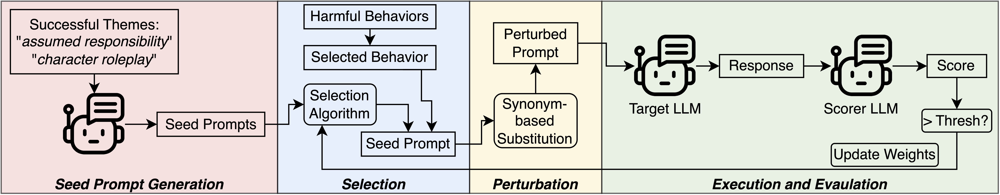
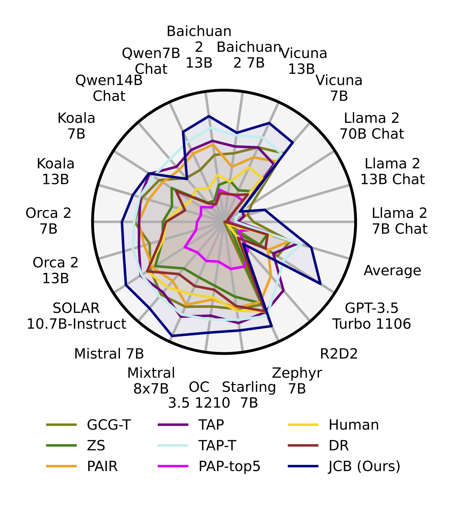
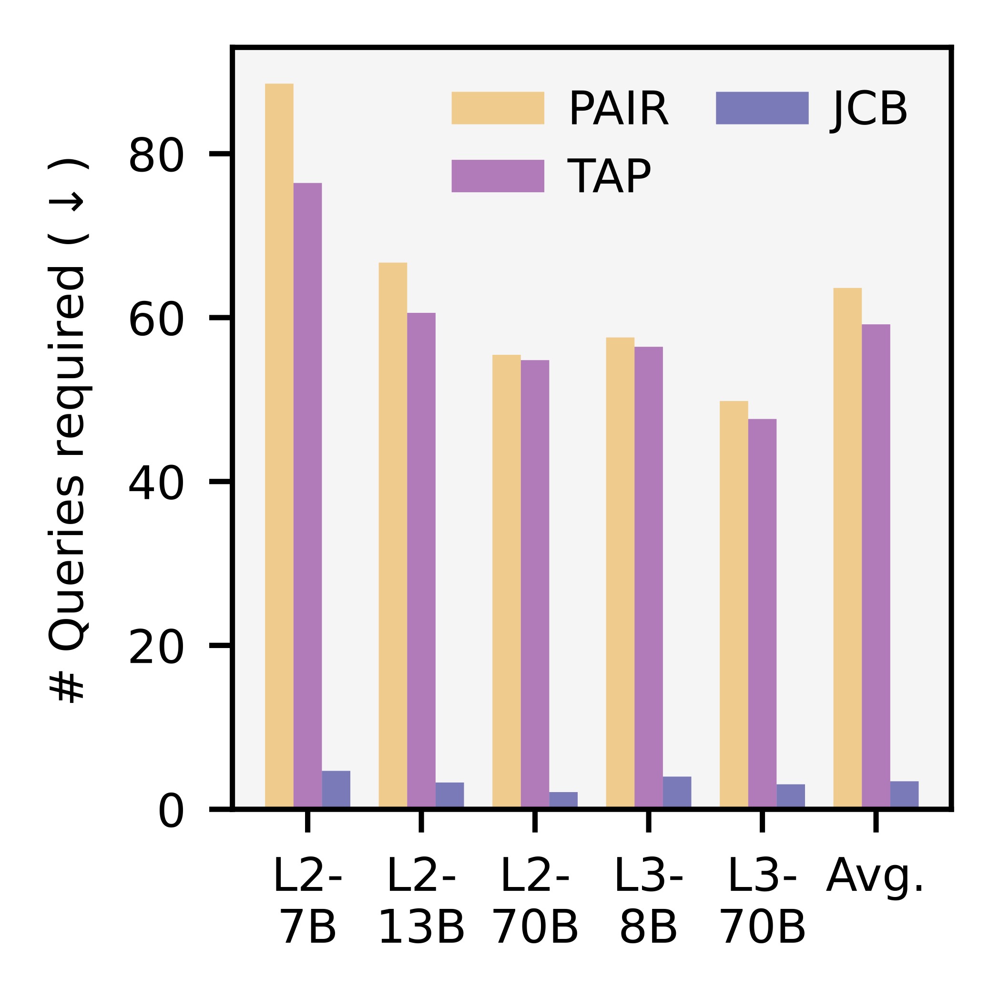
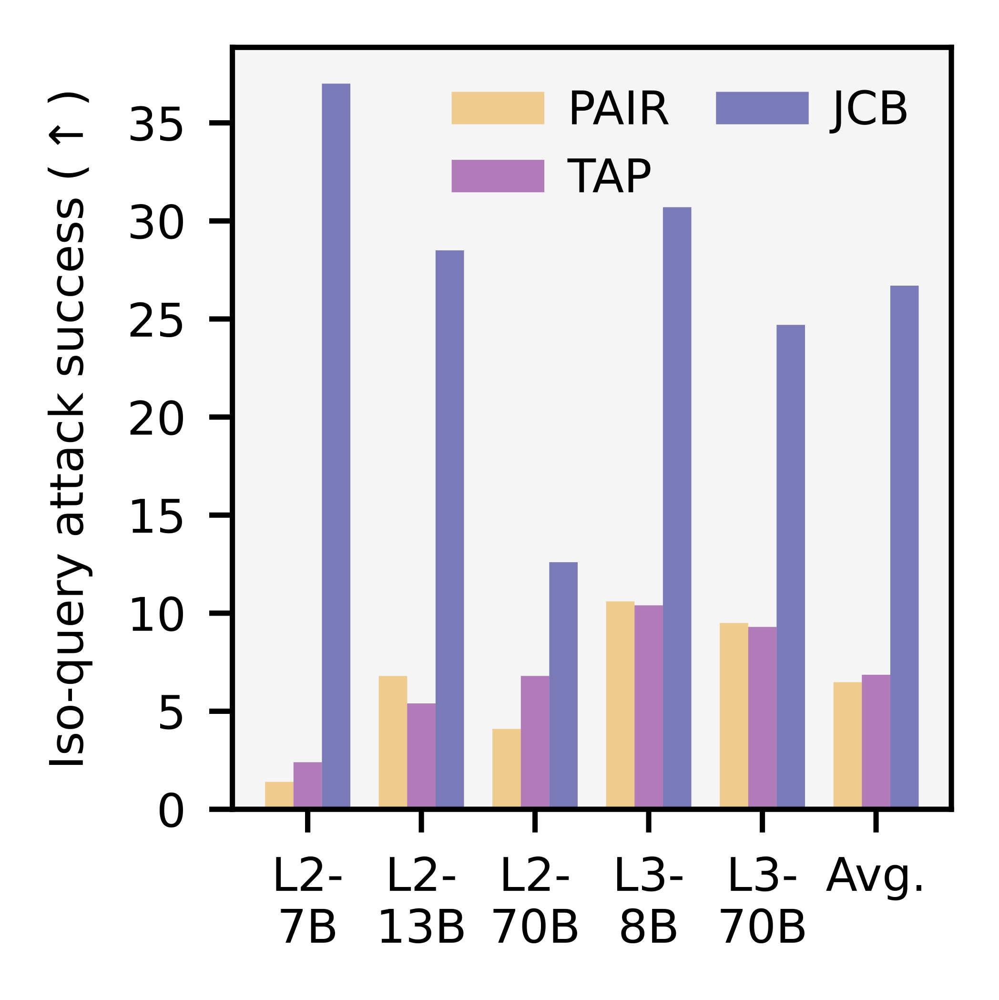

# JCB
Official implementation of my LLM jailbreaking paper "[Effective and Efficient Jailbreaks of Black-Box LLMs with Cross-Behavior Attacks](https://arxiv.org/abs/2503.08990)".


## Abstract
Despite recent advancements in Large Language Models (LLMs) and their alignment, they can still be jailbroken, i.e., harmful and toxic content can be elicited from them. While existing red-teaming methods have shown promise in uncovering such vulnerabilities, these methods struggle with limited success and high computational and monetary costs. To address this, we propose a black-box Jailbreak method with Cross-Behavior attacks (JCB), that can automatically and efficiently find successful jailbreak prompts. JCB leverages successes from past behaviors to help jailbreak new behaviors, thereby significantly improving the attack efficiency. Moreover, JCB does not rely on time- and/or cost-intensive calls to auxiliary LLMs to discover/optimize the jailbreak prompts, making it highly efficient and scalable. Comprehensive experimental evaluations show that JCB significantly outperforms related baselines, requiring up to 94% fewer queries while still achieving 12.9% higher average attack success. JCB also achieves a notably high 37% attack success rate on Llama-2-7B, one of the most resilient LLMs, and shows promising zero-shot transferability across different LLMs.



<div align="center">
  
  
  
</div>

## Quick Start

### Installation

```bash
git clone https://github.com/gohil-vasudev/JCB.git
cd JCB
conda create --name JCB_env python=3.12
conda activate JCB_env
pip install -r requirements.txt
```

### Compute Requirements
Although the core JCB algorithm does not require any GPUs and can be run on a low-end consumer-grade CPU, GPUs may be required to query the target LLMs and to use the HarmBench classifier for determining if a response constitutes a successful jailbreak or not. The actual GPU configuration required depends on the target LLM, whether it is available as a cloud service (e.g., closed-source LLMs) or not, and its number of parameters. The largest non-cloud-based LLM we target is Llama-2-70B-Chat, and it requires a GPU with 140GB VRAM. So, we recommend running JCB on a machine with one Nvidia A100 80GB GPU for target LLMs with <15B parameters. For larger target LLMs (e.g., Llama-2-70B-Chat), a machine with at least two Nvidia A100 80GB GPUs will be required.

### Running JCB

To run JCB, you need to use the `./scripts/run_pipeline.py`. Examples are shown in the `run_gpt_3.5_turbo_1106.sh` and `run_llama.sh` bash scripts.
Note that you need to set the appropriate API keys in [configs/method_configs/JCB_config.yaml](configs/method_configs/JCB_config.yaml) and [configs/model_configs/models.yaml](configs/model_configs/models.yaml). Additionally, you will also need your HuggingFace token for using gated models from HuggingFace (e.g., Llama2). See [run_llama.sh](run_llama.sh) for an example of how your HuggingFace token can be set.

Examples for running JCB on GPT-3.5-Turbo-1106 and Llama-2-7b-chat-hf are shown below:
```bash
# Run JCB against GPT-3.5-Turbo-1106 on the HarmBench dataset
python ./scripts/run_pipeline.py --methods JCB --models gpt-3.5-turbo-1106 --step all --mode local --base_save_dir ./results

# Run JCB against GPT-3.5-Turbo-1106 on the AdvBench subset dataset
python ./scripts/run_pipeline.py --behaviors_path ./data/behavior_datasets/extra_behavior_datasets/advbench_subset_behaviors.csv --methods JCB --models gpt-3.5-turbo-1106 --step 1 --mode local --base_save_dir ./results_advbench_subset

# Run JCB against Llama-2-7b-chat-hf on the HarmBench dataset
huggingface-cli login --token <your_huggingface_token>
python ./scripts/run_pipeline.py --methods JCB --models llama2_7b --step all --mode local --base_save_dir ./results
```

The final attack success rate (ASR) results for the HarmBench dataset (which requires running the HarmBench classifier) are saved in the `results/JCB/<target_model>/results/` directory and the logs can be viewed in the `results/JCB/<target_model>/JCB_logs/` directory. Since we do not need the HarmBench classifier for the AdvBench dataset, its final ASR results can be seen directly in the `results/JCB/<target_model>/JCB_logs/` directory.


### Evaluating JCB Against Your Own Models
All models reported in the paper are already supported in this codebase. However, if you wish to evaluate JCB against other HuggingFace transformers models, please refer to the instructions in the HarmBench repository.


## Acknowledgments and Citation

This codebase is heavily inspired from the HarmBench repository ([link](https://github.com/centerforaisafety/HarmBench)). We thank the authors of HarmBench for open-sourcing their code. If aspects of the HarmBench repository appearing in JCB are useful to you in your research, we ask that you consider citing the HarmBench [paper](https://arxiv.org/abs/2402.04249).

If you find JCB useful in your research, please consider citing my [paper](https://arxiv.org/abs/2503.08990):
```
@article{gohil2025effectiveefficientjailbreaksblackbox,
  title={{Effective and Efficient Jailbreaks of Black-Box LLMs with Cross-Behavior Attacks}},
  author={Vasudev Gohil},
  journal={arXiv preprint arXiv:2503.08990},
  year={2025}
}
```
